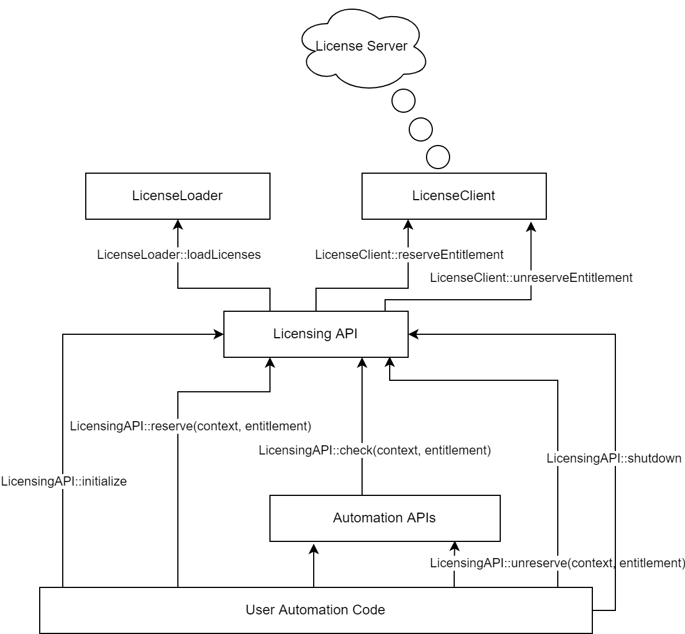
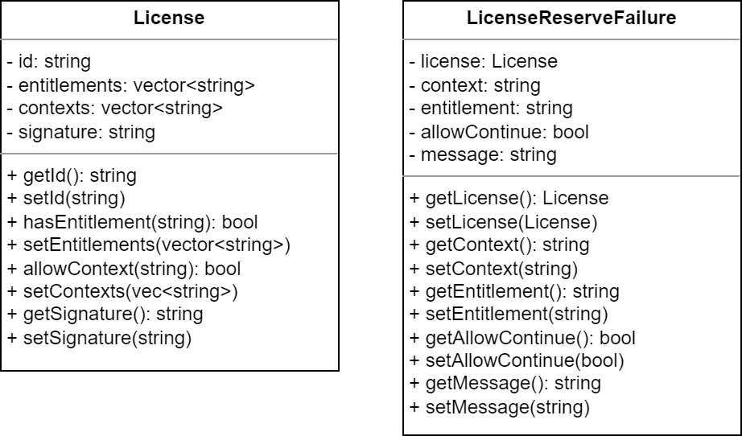

# Licensing System Design Document

## Introduction

This licensing system includes digitally signed local license files that are validated using a remote server. A license can contain different numbers of an arbitrary number of entitlements. Additionally, a license is restricted to a specific number of contexts. The data flow of the licensing system in addition to data models are included below with additional design documentation.

### Source Code

This licensing system is packaged as a dynamically linked library. All public APIs are located in `Licensing/LicensingAPI.h`. Some additional internal APIs are exported for use in testing modules, however, these should not be used in production code.

A test suite for the licensing system is included in the `LicensingUnitTest` folder.

## API Flow Diagram

## Data Model

## Design Documentation

### License Loader

Upon initialization, the licensing system will search a directory for any number of TXT files, each representing a license. The first line of the file represents the license ID, which will be sent to the license server when determining if any reservations are available. The second line is a comma separated list of the contexts for which this license if valid. The third line is a comma separated list of the entitlements that can be reserved by this license. The fourth line is a PGP signature of the previous three lines which prevents user tampering with license files. Upon loading a file, the license loader automatically validates the PGP signature and rejects licenses without an invalid signature.

### License Client

The license client is responsible for communicating with a remote server to ensure that reservation slots for a given context and entitlement are available when requested. The client will attempt to take out a reservation for a given context/entitlement combination and return nothing if successful. If there is an error or no additional reservations can be acquired, it will return the error details in a dedicated error object detailed above. The client is also used when a license is unreserved, since the server needs to know that the associated entitlement is no longer in use.

### Licensing API

The Licensing API ties together the above functionality. When intialized it uses the license loader to load all available licenses. The license client is used whenever an entitlement is reserved or unreserved for a given context. Finally, functionality for checking that a license was successfully reserved exists, which should be included in code accessed by automation APIs, where users may intentionally fail to handle reservation errors.
